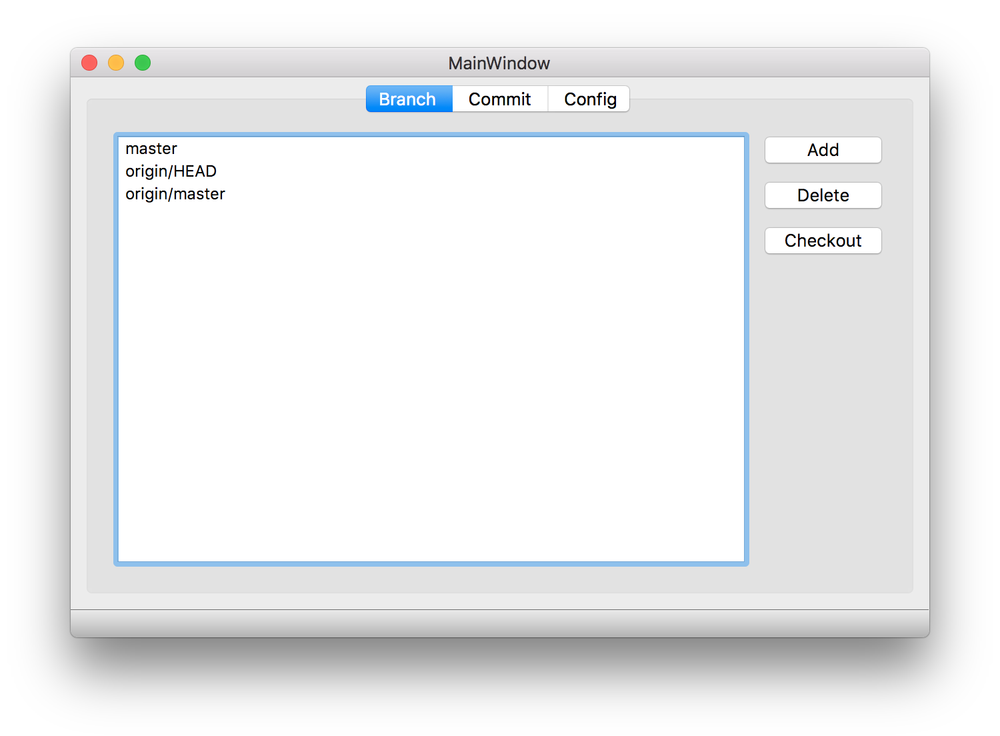
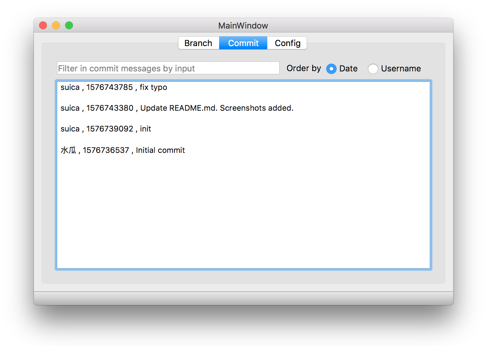
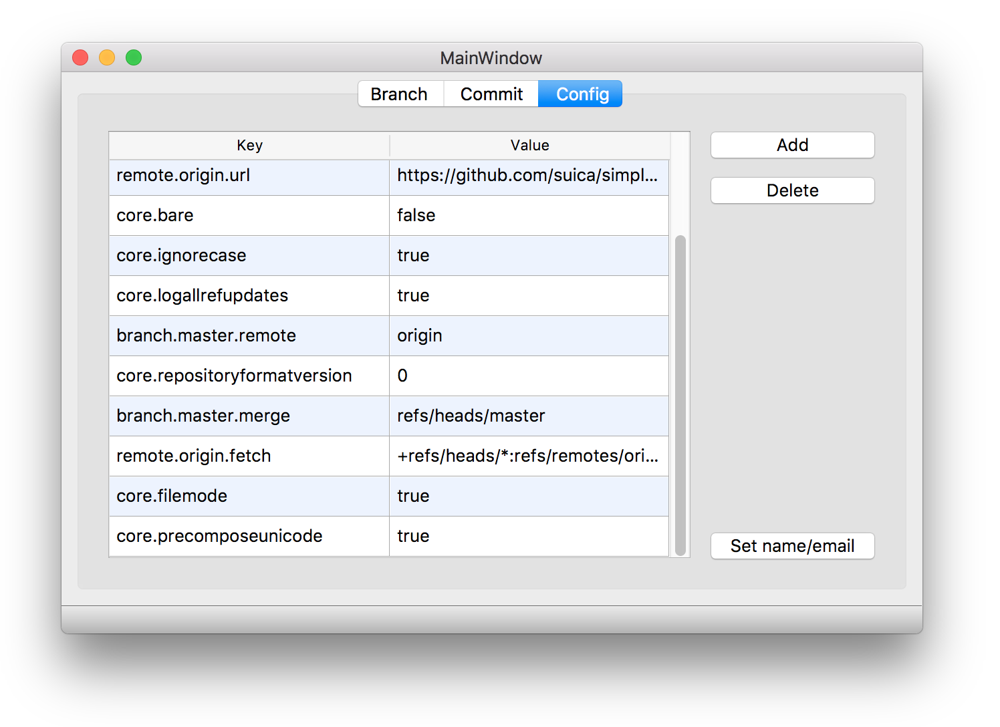

# Simple QT Git Client
A simple QT git client written in C++, which is originally a coursework of User Interfaces course. It is easy to understand, and also suitable for beginners of QT in C++.

## Features

1. It employs QT frameworks and `libgit2` to build a simple but cross-platform Git (note that no GitHub) client.

1. It has a clear file structure, and the code is easy to understand.

## Functionalities

1. Open a existing repository in your local or initialize a folder as a Git repository.

1. Checkout between branches, create or delete branches

1. Search for commits in branches and sort them by username or date.

1. Edit Git environment variables in the current repository.

## Requirements
This application is developed under Mac OS, using QT5 and C++. It can also be built on Windows and Linux, if the environment is properly prepared.

- libgit2.

  - For Mac OS, I recommend you to use `brew install libgit2` to install `libgit2`. Then open the project config file `app.pro`, edit the following lines (32 to 37 lines),

  ```
  macx: LIBS += -L/usr/local/Cellar/libgit2/0.27.5/lib/ -lgit2

  INCLUDEPATH += /usr/local/Cellar/libgit2/0.27.5/include
  DEPENDPATH += /usr/local/Cellar/libgit2/0.27.5/include

  macx: PRE_TARGETDEPS += /usr/local/Cellar/libgit2/0.27.5/lib/libgit2.a
  ```

    changing the paths related to libgit2 to correct paths in your environment.

  If you uses `brew` to install `libgit2`, command `brew list libgit2` will show you the where the libgit2 is. A typical output is 
  ```
    /usr/local/Cellar/libgit2/0.27.5/include/git2/ (78 files)
    /usr/local/Cellar/libgit2/0.27.5/include/git2.h
    /usr/local/Cellar/libgit2/0.27.5/lib/libgit2.0.27.5.dylib
    /usr/local/Cellar/libgit2/0.27.5/lib/pkgconfig/libgit2.pc
    /usr/local/Cellar/libgit2/0.27.5/lib/ (3 other files)
    /usr/local/Cellar/libgit2/0.27.5/share/libgit2/ (16 files)
  ```
  


  - For Linux, use own package manager to install it. If you use ubuntu, try `sudo apt install libgit2`.


- qt5. 
    - Run `where qmake` (Linux) or `which qmake` (Mac OS) to check whether there is qmake, if not, you need to install qt5 it from the official site.
    - If you have `python` and `pip` installed, you just need to install qt5 with python and you are also supposed to find `qmake`. Try `pip install pyqt5`, and it will save you much time than downloading the whole QT framework from the official site.

## For Beginners of Qt

If you find out that it is difficult to understand the code of client, you should first check the code in the folder named `qtdemo`.

It contains a toy demo to play with. The demo also adopts the .ui file generated by QT designer, and the basics of QT slot/signal.

Steps similar to the building of the client could be used to build this toy.

## How to Build

Instructions to build are as follows.
1. Clone the repository.
```
git clone https://github.com/suica/simple_qt_git_client.git
```

2. Go to the cloned repository in your terminal.

```
cd simple_qt_git_client/app
```

3. Create a Makefile.
```
qmake app.pro
```
Or, you could simply input

```
qmake
```

4. Make it!

```
make
```

After the scrolling building messages stops, you are supposed to find the production named `app.app` (Mac OS) or simply `app` (Linux) in the current directory.

## How to Run

- For Mac OS, just give a double click on the production named `app.app`. If you prefer terminal, use `open app.app`. If you are happy, you could also find the executable under `simple_qt_git_client/app/app.app/Contents/MacOS`.

- For Linux, `./app` would help.


## Project Structure

For the convenience to manage and the ease to refactor (QT creator is not good at refactoring, therefore even changing a function signature in this project should be done by manually).


The tree structure is generated by `tree` command. Install it by running `brew install tree` in case you are interested in it.

```
.
├── LICENSE
├── README.md
├── app                        directory of the main client
│   ├── app.pro                project config for client
│   ├── branchtab.hpp          code for the branch tab
│   ├── committab.hpp          code for the commit tab
│   ├── configtab.hpp          code for the config tab
│   ├── dialogwidget.h         declaration of the dialog windows
│   ├── entrance.cpp           the entrance point of the whole client, where the main() locates
│   ├── forms                  folder of ui files generated by QT designer
│   │   ├── chooserepo.ui      layout of the window to choose a repository
│   │   ├── dialog.ui          layout of the windows of dialogs in interaction
│   │   └── mainwindow.ui      layout of the major client interface
│   ├── global.cpp             implementation of global utilities
│   ├── global.h               declaration of global utilities
│   ├── libgit2pp.cpp          provided lib
│   ├── libgit2pp.h            provided lib
│   └── mainwindow.hpp         code of the logic in the whole, also invokes functions in the three tab.hpp
├── pic                        stores the pictures used in README.md
└── qtdemo                     a toy to understand how to use .ui files and the slot/signal mechanism works
    ├── main.cpp               the entrance point of the whole toy, where main() locates
    ├── mainwindow.cpp         implementation of mainwindow
    ├── mainwindow.h           header file of mainwindow
    ├── mainwindow.ui          .ui file generated by QT designer
    └── qtdemo.pro             project config for this toy
```


## Screenshots

Screenshots in Mac OS are provided.

The branch tab.

<center>

</center>

The commit tab.

<center>

</center>

The config tab.

<center>

</center>

## External Resources

`app/libgit2pp.cpp` and `app/libgit2pp.h` are provided as encapsulated libraries as not written by the author.